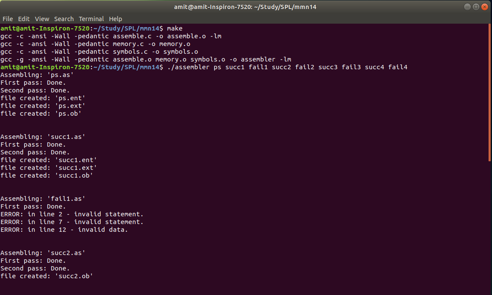
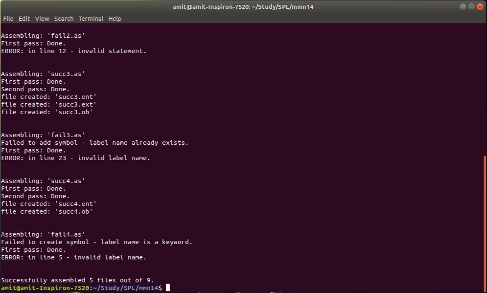
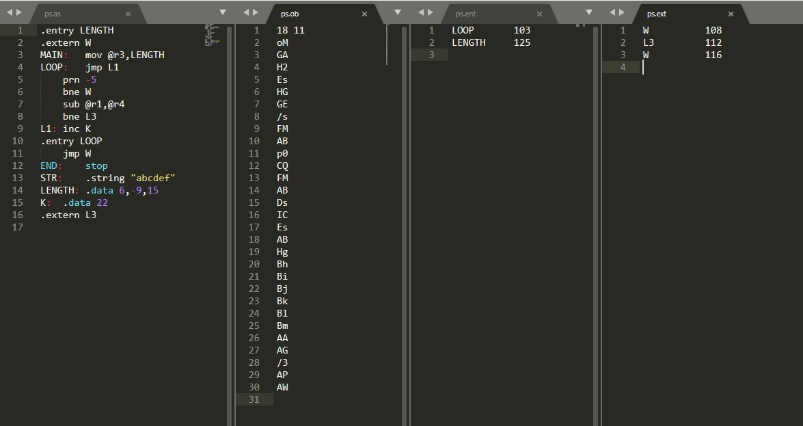

# Assembler

Assembler for a pseudo assembly language.  
Every machine word is 12-bit. The assembler creates 3 files:  
- ob file - The instruction code.  
- ent file - For entry labels in the original code.  
- ext file - External variables to be loaded by linker. 

The final machine code is in base-64 code.  

